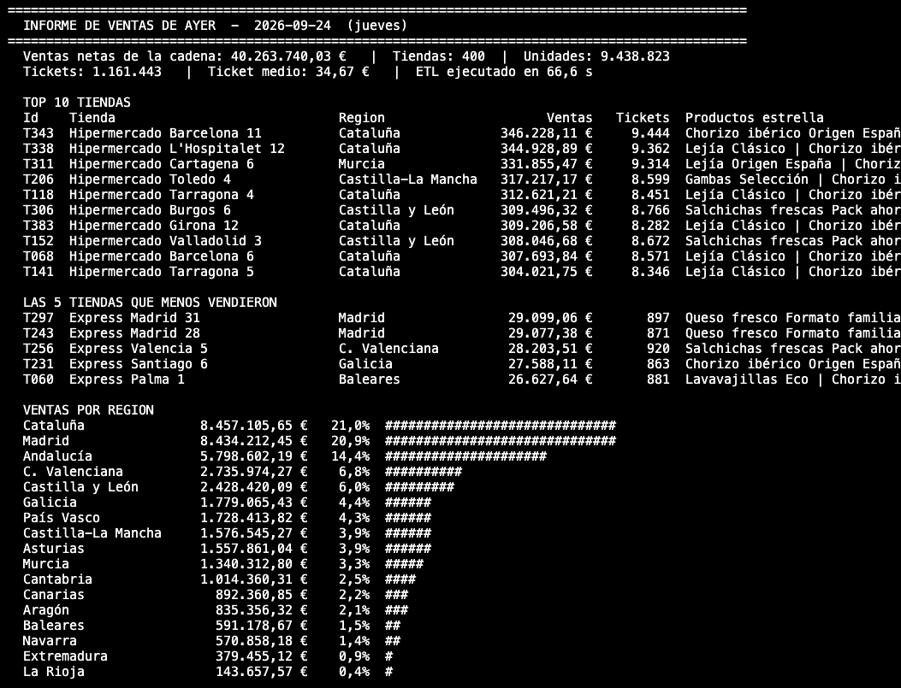

# Demo 1 · Ambari: informe diario de ventas con MapReduce

Clúster Hadoop de 2 nodos gestionado con **Apache Ambari 3.0.0** (compilado desde el código fuente) y el stack **Bigtop 3.3.0** (Hadoop 3.3.6, ZooKeeper 3.8.4). Un jar de MapReduce genera las ventas del día y ejecuta el ETL en YARN.



## Contenido

| Ruta | Qué es |
|---|---|
| [`GUIA-DEMO.md`](GUIA-DEMO.md) | Arquitectura del clúster, guion de la demo (~15 min), checklist y solución de problemas |
| `retail-etl/pom.xml` | Proyecto Maven (Java 8, `hadoop-client` 3.3.6) → `retail-etl.jar` |
| `retail-etl/src/main/java/com/demo/retail/` | `GenerateSales` (map-only, 20 tareas), `DailySalesETL` (2 jobs encadenados), `SalesAgg`, `RetailData` (maestros), `RetailMain` |
| `retail-etl/demo/run-demo.sh` | Genera "ayer" y lanza el ETL, mostrando el progreso |
| `retail-etl/demo/tienda.sh` | ¿Qué vendió ayer la tienda `T042`? |
| `media/informe_ventas_ambari.png` | Captura del informe de la mañana |

## Compilar y ejecutar

```bash
cd retail-etl && mvn package          # target/retail-etl.jar
# en el nodo del clúster, con el jar y los scripts en ~/demo:
~/demo/run-demo.sh                    # ayer
~/demo/run-demo.sh 2026-09-20         # otra fecha
SOLO_ETL=1 ~/demo/run-demo.sh         # solo el ETL
~/demo/tienda.sh T042
```
