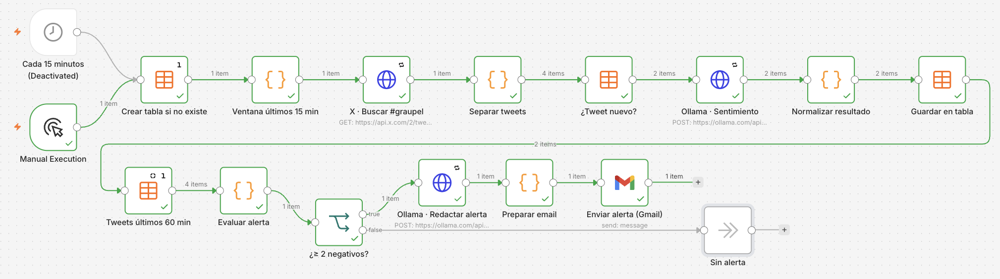
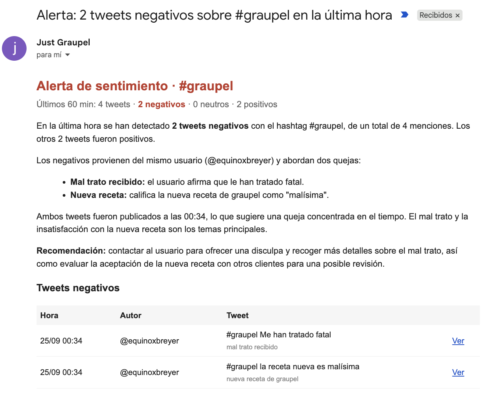

# Demo 1 · n8n: alerta de sentimiento sobre un hashtag

Workflow de n8n que cada 15 minutos busca en X los posts con el hashtag, clasifica cada uno con Ollama Cloud y, si en la última hora hay **2 o más negativos**, redacta un correo con el modelo y lo envía por Gmail.

## Flujo

1. **Cada 15 minutos** (o *Manual Execution* para la demo).
2. **Crear tabla si no existe**: Data Table `graupel_tweets` con los posts ya vistos.
3. **Ventana últimos 15 min** → **X · Buscar #graupel** (búsqueda reciente de la API v2).
4. **Separar tweets** → **¿Tweet nuevo?**: descarta los que ya están en la tabla.
5. **Ollama · Sentimiento** → **Normalizar resultado** → **Guardar en tabla**.
6. **Tweets últimos 60 min** → **Evaluar alerta** → **¿≥ 2 negativos?**
7. Si hay alerta: **Ollama · Redactar alerta** → **Preparar email** → **Enviar alerta (Gmail)**.

Resultado:

## Puesta en marcha

1. En n8n: *Workflows → Import from file* → [`workflow-demo-arde-redes.json`](workflow-demo-arde-redes.json).
2. Crea las credenciales (el JSON no trae ninguna):
   - **X · Buscar #graupel** → *Header Auth*, `Authorization: Bearer <TU_X_BEARER_TOKEN>`.
   - **Ollama · Sentimiento** y **Ollama · Redactar alerta** → *Header Auth*, `Authorization: Bearer <TU_OLLAMA_API_KEY>`.
   - **Enviar alerta (Gmail)** → *Gmail OAuth2*; cambia `destinatario@ejemplo.com` por el destinatario real.
3. Para cambiar el hashtag, edita la consulta del nodo de X y el nombre de la tabla.
4. El trigger de 15 min viene desactivado: actívalo y publica el workflow para que corra solo.

Modelo por defecto: `deepseek-v4.1-flash` en Ollama Cloud (editable en el cuerpo de los nodos de Ollama).
